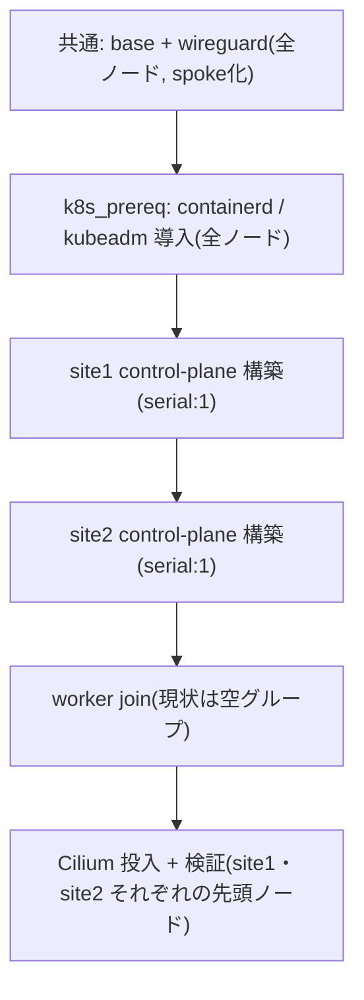

WireGuard とクラスタの構成は `make gateway`(Linode)と `make cluster`
(6台のノード)の2段階に分かれる。実体は `ansible/playbooks/gateway.yml` /
`cluster.yml`(`site.yml` はこの2つをまとめて実行する)。

## make gateway: ゲートウェイ構成

```sh
make gateway
```

Linode 上に `base` ロール(ユーザー・sshd・sysctl・unattended-upgrades)と
`wireguard` ロール(hub 構成 + nftables の masquerade / DNAT / MSS clamp)
を適用する。

✅ 検証:

- `wg show` で peer が7台分(6ノード + 管理者マシン)登録されている
- `nft list ruleset` で masquerade / DNAT / MSS clamp のルールが入っている

## make cluster の前に: DHCP 予約で LAN IP を固定する

ノードは DHCP クライアントであり、LAN IP はルーター側の **MAC アドレス予約
(固定リース)** で固定する。kubeadm は init/join 時点の LAN IP を
etcd のピア URL や advertiseAddress に焼き込むため、**予約が済む前に
`make cluster` を実行してはいけない**(後から IP が変わるとクラスタ再構築に
なる)。推奨する割り当て:

| ノード | 予約する LAN IP |
|---|---|
| site1-node1〜3 | 192.168.10.11 / .12 / .13 |
| site2-node1〜3 | 192.168.20.11 / .12 / .13 |

この表は人間(ルーター設定)用のリファレンスで、Ansible はこの値に依存しない
(接続は wg アドレス、k8s 用 IP は実行時のファクトで拾う)。ただし
**kube-vip の VIP(.10)は必ず DHCP プールの範囲外にする**こと。

手順(各ノードの node-bootstrap 完了後、リモートで):

```sh
ssh moripa@10.100.0.11 ip -br link show   # MAC アドレスを確認
# → ルーターの管理画面で MAC に対して上表の IP を予約
ssh moripa@10.100.0.11 sudo netplan apply  # リースを取り直す(または再起動)
ssh moripa@10.100.0.11 ip -4 -br addr show # ✅ 予約した IP になっていることを確認
```

✅ **6台すべてが予約どおりの IP を保持していることを確認してから**次へ進む。

## make cluster: プレイ順序



`ansible/playbooks/cluster.yml` の実際のプレイ構成に対応する。site1 と
site2 は独立クラスタなので、それぞれの control-plane 構築は互いに依存しない
順次実行(`serial: 1` で先頭ノードの `kubeadm init` 完了後に残りが join する。
etcd メンバー追加の同時実行を避けるため)。Cilium の投入は両拠点の先頭
control-plane に対して最後にまとめて行う。

```sh
make cluster
```

## 検証項目

### WireGuard 疎通(プレイ内の検証タスクでも自動確認)

- ✅ 各ノードで `curl ifconfig.me` が Linode の IP を返す(フルトンネル)
- ✅ `ping 10.100.0.1` 成功、`wg show` の handshake が新しい
- ✅ `ip route get <同一拠点の他ノードIP>` が LAN NIC を返す
  (**クラスタ内通信は LAN 直通**であることの確認。詳細は
  `/docs/architecture/wireguard`)
- ✅ `ip rule` に priority 100 の除外ルール(LAN / Pod / Service CIDR)が3本

### クラスタ Ready(拠点ごとに確認)

- ✅ `kubectl get nodes` で各クラスタ3台が Ready(taint なし)
- ✅ `cilium status --wait` が全緑。任意で `cilium connectivity test`

### VIP フェイルオーバーテスト

先頭ノードの kubelet を止めても、kube-vip の VIP(site1: `192.168.10.10` /
site2: `192.168.20.10`)への ping と `kubectl` 操作が継続することを確認する。
確認後は kubelet を戻す。

### DNAT 確認

- ✅ 外部から `nc -vz <linode_ip> 25565`(Minecraft デプロイ後)
- ✅ `curl -v http://<linode_ip>`(ingress デプロイ後)
- ✅ アプリログでクライアントの実IPが見える(SNAT されていないこと)
- ✅ Pod 内から大きな HTTPS レスポンスを取得できる(MSS clamp / MTU の検証)

<Callout title="拠点ごとの独立性">
  site1 / site2 の control-plane 構築・検証はそれぞれ独立している。片方の
  拠点で問題が出ても、もう片方には影響しない(設計判断の詳細は
  `/docs/architecture/overview`)。
</Callout>
