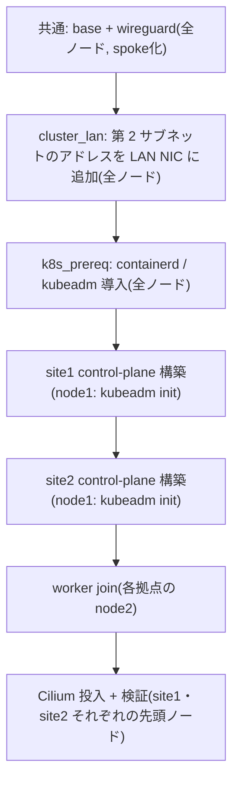

WireGuard とクラスタの構成は `make gateway`(Linode)と `make cluster`
(4台のノード)の2段階に分かれる。実体は `ansible/playbooks/gateway.yml` /
`cluster.yml`(`site.yml` はこの2つをまとめて実行する)。

## make gateway: ゲートウェイ構成

```sh
make gateway ANSIBLE_ARGS='-e ansible_host=<gateway_public_ip>'   # 初回(wg 確立前)は公開 IP 経由
make gateway                                                      # 以降は wg 経由(inventory の ansible_host = 10.100.0.1)
```

Linode 上に `base` ロール(ユーザー・sshd・sysctl・unattended-upgrades)、
`wireguard` ロール(hub 構成 + nftables の masquerade / 公開ポート / MSS clamp)、
`auth_proxy` ロール(oauth2-proxy ×2。`oauth2_proxy_enabled` のときだけ起動)、
`reverse_proxy` ロール(Caddy。caddy-dns/cloudflare 入りのカスタムビルドを導入し、
`gateway/caddy/Caddyfile` を git から取り込む `caddy-gitops.timer` を仕込む)、
`tcp_proxy` ロール(HAProxy。`tcp_routes` から haproxy.cfg を生成)を適用する。

✅ 検証:

- `wg show` で peer が5台分(4ノード + 管理者マシン)登録されている
- `nft list ruleset` で masquerade / MSS clamp / `iifname "wg0" oifname "wg0" accept`
  と、input chain の `tcp dport { 80, 443 } accept` が入っている(`tcp_routes` を足せば
  その port の accept も並ぶ)
- `systemctl status caddy caddy-gitops.timer` が active。`caddy version` が
  `versions.yml` の `caddy_version`、`caddy list-modules | grep cloudflare` が出る。
  `journalctl -u caddy` に 5 枚のワイルドカード証明書の取得ログ(`certificate obtained`)
  が出る(DNS-01 なので DNS 伝播待ちで数十秒かかる)
- `systemctl status haproxy` が active。ノード未構築のうちは backend が全 DOWN で正常

## make cluster の前に: 初回接続はパスワード認証

現地で OS を入れた直後のノードには SSH 鍵も sudo の NOPASSWD も無いため、
初回の `make cluster` は現地作業者に渡した `moripa` のパスワードで接続する。
`ansible/group_vars/k8s_cluster/bootstrap.sops.yml`(example をコピーして
`sops -e -i`)に `ansible_password` / `ansible_become_password` を置くと
Ansible が自動で使う。管理機には `sshpass` が必要。`base` ロールが鍵と
NOPASSWD を配った後はパスワードは使われないが、ファイルは残してよい。

## make cluster の前に: ルーター側の設定は不要

ノードの LAN は DHCP のままでよく、ルーター側の設定(固定リース等)は
不要。`make cluster` の中で `cluster_lan` ロールが、ルーターと無関係な
第 2 サブネット(`cluster_lan_cidr`)の固定アドレスを netplan で LAN NIC に
追加し、kubeadm / kubelet / kube-vip / Cilium はそのアドレスだけを使う
(設計は `/docs/architecture/wireguard`)。前提は次の 2 点だけ。

- 各ノードの node-bootstrap が完了し、`ssh moripa@10.100.0.11` などが通る
- 同一拠点の 2 台が同じルーター/スイッチの有線ポートにつながっている
  (第 2 サブネットは同一 L2 でしか通らない)

| ノード | 役割 | wg アドレス(管理) | lan_address(クラスタ) |
|---|---|---|---|
| site1-node1 / node2 | control-plane / worker | 10.100.0.11 / .12 | 10.200.1.11 / .12(VIP .10) |
| site2-node1 / node2 | control-plane / worker | 10.100.0.21 / .22 | 10.200.2.11 / .12(VIP .10) |

<Callout title="netplan apply は wg 越しに実行される" type="warn">
  `cluster_lan` は管理経路(wg)越しに `netplan apply` を実行する。
  systemd-networkd が wg-quick のポリシールールを消さないよう drop-in
  (`ManageForeignRoutingPolicyRules=no`)を先に入れ、apply 直後にハブへの
  ping で経路が生きていることを検査する。この手順は実機では未検証のため、
  初回は 1 台ずつ実行し(`make cluster` には limit が無いので
  `cd ansible && ../.venv/bin/ansible-playbook playbooks/cluster.yml --limit site1-node1`)、
  切れたら現地でのコンソールログインか node-bootstrap の再実行で復旧する。
  相手ノードとの疎通検証は、相手が play に含まれるときだけ行われる。
</Callout>

## make cluster: プレイ順序



`ansible/playbooks/cluster.yml` の実際のプレイ構成に対応する。site1 と
site2 は独立クラスタなので、それぞれの control-plane 構築は互いに依存しない。
各拠点の control-plane は node1 の 1台で、`kubeadm init` 後に node2 が
worker として join する(`serial: 1` は将来 CP を追加したときに etcd メンバー
追加の同時実行を避けるためのもの)。Cilium の投入は両拠点の control-plane に
対して最後にまとめて行う。

worker の join タスクは join トークンを隠すため `no_log` になっており、失敗時に
エラーの詳細が出ない。失敗したら該当ノードで `journalctl -u kubelet` を見るか、
`ansible-playbook -v` で再実行する。

```sh
make cluster
```

## 検証項目

### WireGuard 疎通(プレイ内の検証タスクでも自動確認)

- ✅ 各ノードで `curl ifconfig.me` が Linode の IP を返す(フルトンネル)
- ✅ `ping 10.100.0.1` 成功、`wg show` の handshake が新しい
- ✅ `ip -4 addr show` で LAN NIC に DHCP のアドレスと `lan_address`
  (10.200.x.x)の両方が付いている
- ✅ 同一拠点の他ノードの `lan_address` へ `ping` が通り、`ip route get` が
  LAN NIC を返す(**クラスタ内通信は LAN 直通**。詳細は
  `/docs/architecture/wireguard`)
- ✅ `ip rule` に priority 100 の除外ルール(cluster_lan / Pod / Service CIDR)が3本

### クラスタ Ready(拠点ごとに確認)

- ✅ `kubectl get nodes` で各クラスタ2台が Ready(node1 は control-plane
  ロールだが taint なし、node2 は worker)
- ✅ 管理者マシンから wg 経由で `kubectl` が通る。kubeadm の `admin.conf` は
  kube-vip の VIP(`10.200.1.10:6443`)を指すが VIP は wg から届かないため、
  手元の kubeconfig は server を node1 の wg アドレス
  (`https://10.100.0.11:6443`、certSANs 済み)に書き換えて使う。
  control-plane は 1台なのでフェイルオーバーは存在しない(node1 停止 = API 停止)
- ✅ `kubectl get nodes -o wide` の INTERNAL-IP が `lan_address`(10.200.x.x)
- ✅ `cilium status --wait` が全緑。`cilium connectivity test` で node2 ↔ node1
  の Pod 間通信(LAN 直通の VXLAN)が通る

### etcd バックアップ

control-plane が 1台のため、node1 の全損に備えて etcd スナップショットの
定期取得が必須(未実装。README の次のステップ参照)。

### 公開経路の確認

- ✅ HAProxy: `tcp_routes` を足したあと、外部から `nc -vz <linode_ip> <port>` が通る
  (`allowed_sources` を設定済みならそのホストから)。
  `ssh moripa@10.100.0.1 'echo "show stat" | sudo socat stdio /run/haproxy/admin.sock'`
  で backend の両ノードが UP。`tcp_routes` が空のうちは listen も backend も無い
- ✅ Caddy: 規約に沿った名前(例 `test.site1.dev.morino.party`)で
  `curl -v https://<host>` が対象拠点の Gateway に届く(HTTPRoute 未作成なら
  Envoy の 404 が返るのが正常)。DNS 反映前は証明書が無いので HTTPS は
  検証できない。`curl -v --resolve <host>:80:<linode_ip> http://<host>` で
  Caddy の HTTPS リダイレクト(308)が返れば Caddy が受けている
- ✅ Caddy 経由のリクエストで、アプリ側に `X-Forwarded-For` としてクライアントの
  実IPが届く(Cilium の `gatewayAPI.xffNumTrustedHops: 1` の検証)
- ✅ Pod 内から大きな HTTPS レスポンスを取得できる(MSS clamp / MTU の検証)

<Callout title="拠点ごとの独立性">
  site1 / site2 の control-plane 構築・検証はそれぞれ独立している。片方の
  拠点で問題が出ても、もう片方には影響しない(設計判断の詳細は
  `/docs/architecture/overview`)。
</Callout>
