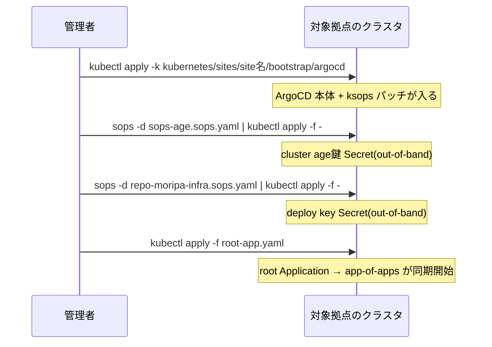

CNI が入っていないクラスタでは ArgoCD 自体が正常に動けないため、ArgoCD
導入は `make cluster` の後、**拠点ごとに個別に**実行する。

## 実行

kubeconfig をその拠点のクラスタ(API サーバーは kube-vip の VIP)に向けて
から実行する。

```sh
KUBECONFIG=~/kube/site1 make bootstrap-argocd SITE=site1
KUBECONFIG=~/kube/site2 make bootstrap-argocd SITE=site2
```

## 内部で行われること



## out-of-band で投入する2つの Secret

ArgoCD が Git リポジトリを読めるようになる**前**に必要な Secret のため、
GitOps 経路には乗せられない。`make bootstrap-argocd` が `sops -d | kubectl
apply` で直接投入する。これ以外の Secret はすべて ksops 経由(GitOps)で
管理する方針。

| Secret | 中身 | 拠点間の共有 |
|---|---|---|
| `sops-age` | cluster 用 age 秘密鍵。repo-server がこれで Git 上の暗号化ファイルを復号する | 共有(1鍵を両拠点に投入) |
| repo 用 deploy key(`repo-moripa-infra`) | GitHub read-only deploy key の秘密鍵。repo-server が clone に使う | 共有(1鍵を両拠点に投入) |

準備手順は `kubernetes/sites/site1/bootstrap/secrets/README.md`
(site2 も同一手順)を参照。

## app-of-apps と sync wave

`root-app.yaml` が唯一 `kubectl apply` する Application で、
`kubernetes/sites/<site>/bootstrap/applications/` を指す第2の app-of-apps
(`apps`)を含めて残りをすべて同期する。同期順序は sync wave で制御される
(詳細な図は `/docs/architecture/gitops`)。

| wave | Application | 内容 |
|---|---|---|
| -3 | `gateway-api-crds` | Gateway API CRD(Cilium より先に必須) |
| -2 | `cilium` | Cilium(Ansible の Helm リリースを引き取る) |
| -1 | `cert-manager` | cert-manager |
| 0 | `ingress` | Cilium Gateway API(hostNetwork) |
| 1 | `monitoring` | 監視 |
| 2 | `apps` | 第2の app-of-apps(`kubernetes/sites/<site>/apps/`) |

## Cilium 引き取りの diff ゼロ確認

`cilium` Application は `helm.cilium.io` の chart と、Git 上の
`kubernetes/common/cilium/values.yaml` → `kubernetes/sites/<site>/infrastructure/cilium/values.yaml`
の順で読む multi-source 構成になっている。この順序は Ansible
(`k8s_bootstrap` ロールが Helm へ渡す `-f` の順序)と同一であるため、
Ansible が入れた Cilium の Helm リリースをそのまま ArgoCD が引き取れる
はずである。

✅ 検証:

- 各拠点で `kubectl -n argocd get applications` の全項目が `Synced` /
  `Healthy`
- **`cilium` Application の diff がゼロ**であること。diff が出る場合は
  values の乖離が疑われるため `make check-consistency` を実行する

<Callout title="cilium Application は prune しない">
  CNI を誤って削除するとクラスタ全体が壊れるため、`cilium` と `root` の
  Application は `prune: false` にしてある(安全側)。
</Callout>
