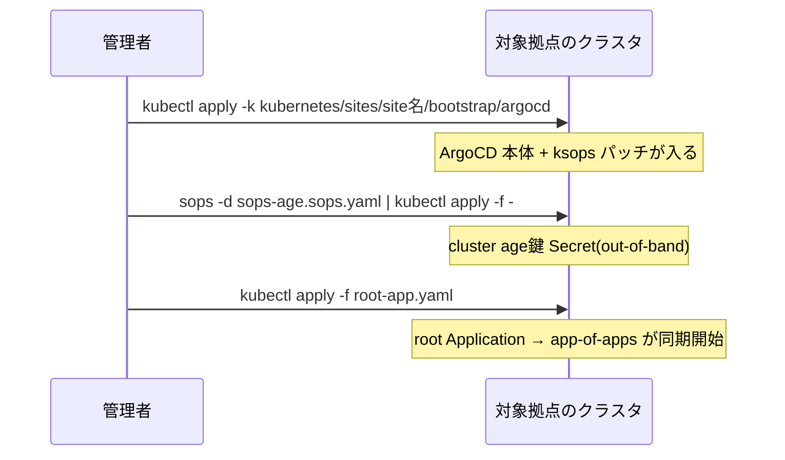

CNI が入っていないクラスタでは ArgoCD 自体が正常に動けないため、ArgoCD
導入は `make cluster` の後、**拠点ごとに個別に**実行する。

## 実行

kubeconfig をその拠点のクラスタに向けて wg 経由で実行する。kubeadm の
`admin.conf` は kube-vip の VIP(`10.200.1.10:6443`)を指すが VIP は wg から
届かないため、手元の kubeconfig は server を node1 の wg アドレス
(site1 は `https://10.100.0.11:6443`)に書き換えたものを使う。

```sh
KUBECONFIG=~/kube/site1 make bootstrap-argocd SITE=site1
KUBECONFIG=~/kube/site2 make bootstrap-argocd SITE=site2
```

## UI へのアクセス

site1 の ArgoCD は `https://argocd.site1.dev.morino.party/` で開ける(Ingress は
`kubernetes/sites/site1/bootstrap/argocd/ingress.yaml`、TLS は Linode の Caddy が終端し
argocd-server は `server.insecure: "true"` で HTTP 待ち受け)。ArgoCD 自身のログインが
あるため公開側(`dev`)のホスト名にしてある。初期パスワードは
`kubectl -n argocd get secret argocd-initial-admin-secret -o jsonpath='{.data.password}' | base64 -d`
で取り、ログイン後に変更して Secret を削除する。CLI は
`argocd login argocd.site1.dev.morino.party --grpc-web`。

ArgoCD 本体の overlay(`bootstrap/argocd/`)は Application では管理していないので、
変更したら `kubectl apply --server-side --force-conflicts -k kubernetes/sites/site1/bootstrap/argocd` を再実行する(CRD が大きいため server-side)。

## 内部で行われること



## out-of-band で投入する Secret(1つ)

ArgoCD が Git 上の暗号化ファイルを復号できるようになる**前**に必要な Secret
のため、GitOps 経路には乗せられない。`make bootstrap-argocd` が
`sops -d | kubectl apply` で直接投入する。これ以外の Secret はすべて
ksops 経由(GitOps)で管理する方針。

| Secret | 中身 | 拠点間の共有 |
|---|---|---|
| `sops-age` | cluster 用 age 秘密鍵。repo-server がこれで Git 上の暗号化ファイルを復号する | 共有(1鍵を両拠点に投入) |

repo アクセスは認証なしの https(public リポジトリ)なので、repo 用の
Secret は不要。

準備手順は `kubernetes/sites/site1/bootstrap/secrets/README.md`
(site2 も同一手順)を参照。

## app-of-apps と sync wave

`root-app.yaml` が唯一 `kubectl apply` する Application で、
`kubernetes/sites/<site>/bootstrap/applications/` を指す第2の app-of-apps
(`apps`)を含めて残りをすべて同期する。同期順序は sync wave で制御される
(詳細な図は `/docs/architecture/gitops`)。

| wave | Application | 内容 |
|---|---|---|
| -3 | `gateway-api-crds` | Gateway API CRD(現在は未使用。公開経路は Ingress) |
| -2 | `cilium` | Cilium(Ansible の Helm リリースを引き取る) |
| -1 | `cert-manager` | cert-manager(クラスタ内部向け。公開 TLS は Linode の Caddy) |
| 0 | `longhorn` | Longhorn(既定 StorageClass。site1 のみ) |
| 1 | `monitoring` | 監視 |
| 2 | `apps` | 第2の app-of-apps(`kubernetes/sites/<site>/apps/`) |

## Cilium 引き取りの diff ゼロ確認

`cilium` Application は `helm.cilium.io` の chart と、Git 上の
`kubernetes/common/cilium/values.yaml` → `kubernetes/sites/<site>/infrastructure/cilium/values.yaml`
の順で読む multi-source 構成になっている。この順序は Ansible
(`k8s_bootstrap` ロールが Helm へ渡す `-f` の順序)と同一であるため、
Ansible が入れた Cilium の Helm リリースをそのまま ArgoCD が引き取れる
はずである。

✅ 検証:

- 各拠点で `kubectl -n argocd get applications` の全項目が `Synced` /
  `Healthy`
- **`cilium` Application の diff がゼロ**であること。diff が出る場合は
  values の乖離が疑われるため `make check-consistency` を実行する

<Callout title="cilium / longhorn Application は prune しない">
  CNI を誤って削除するとクラスタ全体が壊れ、Longhorn の CRD が消えるとボリュームの
  実データを失うため、`cilium`・`longhorn`・`root` の Application は
  `prune: false` にしてある(安全側)。
</Callout>

## Longhorn の確認(site1)

`longhorn` Application は charts.longhorn.io の chart と Git 上の
`kubernetes/sites/site1/infrastructure/storage/longhorn-values.yaml`、同ディレクトリの
Ingress を multi-source で同期する。ノード側の前提(`/data` LV、iscsid、nfs-common)は
`make cluster` の `longhorn_prereq` ロールが済ませている。

✅ 検証:

- `kubectl -n longhorn-system get pods` がすべて Running(manager / instance-manager /
  csi-* が各ノードに載る)
- `kubectl get storageclass` に `longhorn (default)` がある
- `kubectl -n longhorn-system get nodes.longhorn.io` に 3 ノードが Schedulable で並び、
  ディスクが `/data/longhorn` になっている
- `https://longhorn.site1.private.dev.morino.party/`(oauth2-proxy のログイン後)で
  UI が開き、3 ノードとディスクの空きが見える
- PVC を 1 つ作って Pod から書き込み、`kubectl -n longhorn-system get volumes.longhorn.io`
  でレプリカが 3 であることを確認したら削除する
