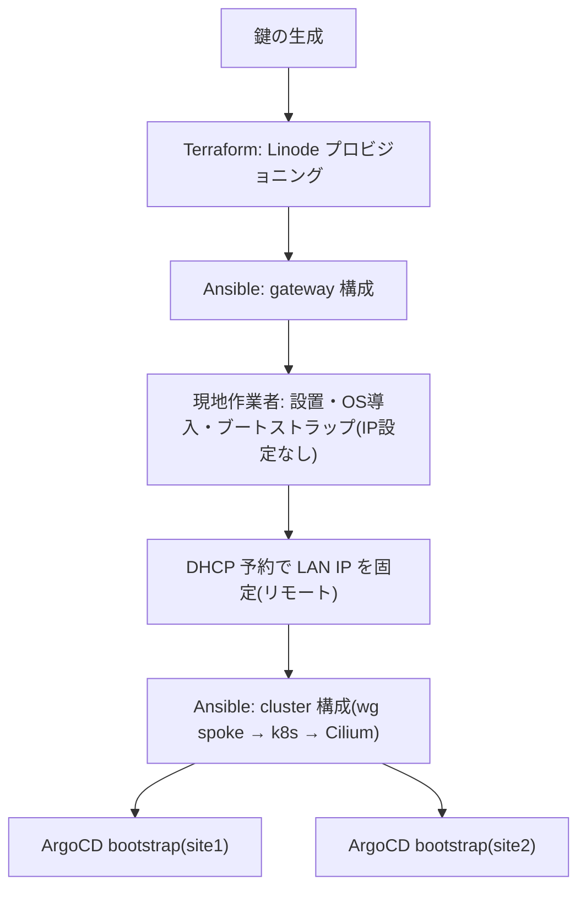
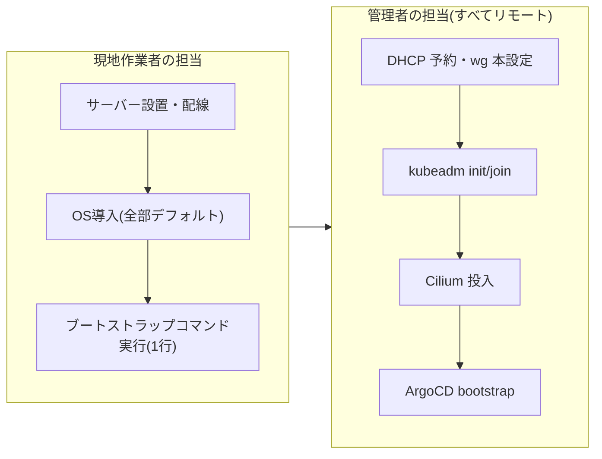

このセクションは、管理者(このリポジトリの操作者)向けの手順書です。
ゼロから2拠点のクラスタを立ち上げる全体の流れと、各フェーズの詳しい手順を
ページごとに分けて説明します。実際の値や生の手順は各ページを参照してください。

## 全体フロー

| フェーズ | 実行者 | 詳細ページ |
|---|---|---|
| 鍵の生成(age / WireGuard / deploy key) | 管理者 | `/docs/admin/keys` |
| Linode のプロビジョニング | 管理者 | `/docs/admin/terraform` |
| gateway 構成(WireGuard ハブ + NAT) | 管理者 | `/docs/admin/ansible` |
| サーバー設置・OS導入・固定IP・ブートストラップ実行 | 現地作業者 | (現地作業者向けセクション) |
| cluster 構成(wg spoke・kubeadm・Cilium) | 管理者(リモート) | `/docs/admin/ansible` |
| ArgoCD bootstrap(拠点ごと) | 管理者(リモート) | `/docs/admin/argocd` |
| 定常運用・障害対応 | 管理者 | `/docs/admin/operations` |

## 現地作業者との分担境界

現地作業者にお願いするのは**物理設置とネットワーク疎通の確保、そして
1行のブートストラップコマンドの実行まで**です。それ以降の作業(WireGuard
の本設定、Kubernetes のブートストラップ、ArgoCD 導入)はすべて管理者が
リモートから行います。現地に人を再度派遣する必要はありません。

<Callout title="ブートストラップコマンドは管理者が事前に用意する">
  現地作業者が実行する1行のコマンドは、そのノードの `wg0.conf` を書き込み
  WireGuard を導入・起動する管理者自作のスクリプトです。中身に WireGuard
  の秘密鍵が含まれるため取り扱いに注意してください。詳細は
  `/docs/admin/keys` を参照してください。
</Callout>

<Cards>
  <Card title="1. 鍵の一覧" description="事前に生成すべき鍵・秘密情報の完全なリスト" href="/docs/admin/keys" />
  <Card title="2. Terraform" description="Linode のプロビジョニング" href="/docs/admin/terraform" />
  <Card title="3. Ansible" description="gateway / cluster の構成と検証" href="/docs/admin/ansible" />
  <Card title="4. ArgoCD" description="拠点ごとの GitOps bootstrap" href="/docs/admin/argocd" />
  <Card title="5. 運用" description="定常運用・障害対応" href="/docs/admin/operations" />
</Cards>
