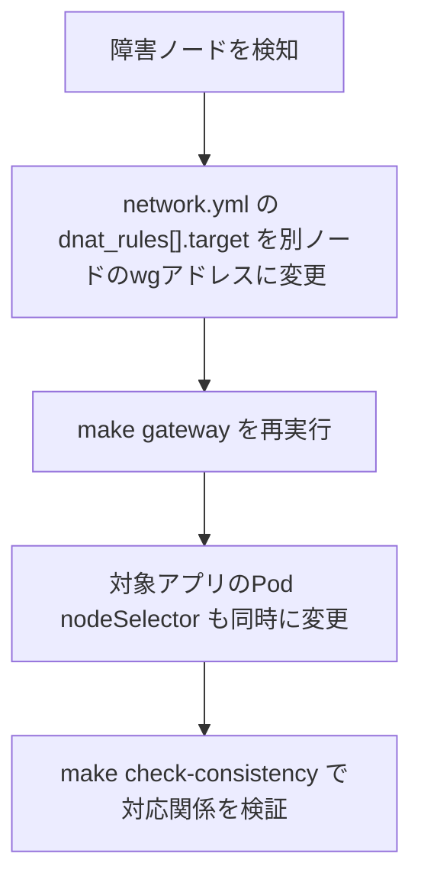

構築が完了したあとの、日常的な運用手順とトラブル対応の指針。

## SSH は wg 経由のみ

公開 SSH は bootstrap 後に閉じてあるため、通常運用では WireGuard 経由でのみ
アクセスする。

```sh
ssh moripa@10.100.0.1    # ゲートウェイ(linode-gw)
ssh moripa@10.100.0.11   # site1-node1
ssh moripa@10.100.0.21   # site2-node1
```

<Callout title="公開SSHを閉じる前の必須確認(再掲)">
  管理者マシンを `wg_extra_peers` に登録し `make gateway` を再実行済みで、
  管理者マシンの wg0 から `ssh moripa@10.100.0.1` が通ることを確認してから
  `bootstrap_ssh_cidrs` を空にして re-apply すること。閉じたあとに wg が
  壊れた場合の復旧は Linode の LISH コンソールのみ(`/docs/admin/keys`、
  `/docs/admin/terraform` 参照)。
</Callout>

## DNAT フェイルオーバー手順

DNAT 先ノード(例: site1-node1)が障害を起こした場合の切り替え手順。



`ansible/group_vars/all/network.yml` の `dnat_rules[].target` を別ノードの
wg アドレスに変更し `make gateway` を再実行する。Minecraft のような
`externalTrafficPolicy: Local` + node ピン構成のアプリは、Pod の
nodeSelector の変更も同時に行う必要がある。target と nodeSelector の
対応関係は `make check-consistency` が検査する。

## VIP 全損時の挙動

kube-vip の VIP が全損すると、Cilium agent の API サーバー接続も切れる
(kube-proxy replacement 構成のため `k8sServiceHost` が VIP を直指定して
いる)。ただし**既存のデータプレーンはそのまま動き続ける**(新規の Pod
スケジューリングや設定変更ができなくなるだけ)。復旧は各 control-plane の
kubelet / kube-vip の状態確認から着手する。

## wg syncconf と restart の使い分け

| 変更内容 | 反映方法 | 理由 |
|---|---|---|
| Peer の追加・削除、AllowedIPs の変更など | `wg syncconf`(Ansible の handler) | 既存セッション・DNAT 経由の接続を切断せずに反映できる |
| `Address` / `MTU` / `PostUp` などの Interface 行 | `wg-quick@wg0 restart`(計画的に実施) | インターフェース自体の再構築が必要なため、フルトンネル確立後の restart は自分の管理セッションを切断する |

## Nanode の転送量監視

Nanode は **1TB/月の転送量制限**と共有1vCPUという制約がある。フルトンネル
構成では6台分の外向き通信(イメージ pull、OS 更新、公開サービスのトラフィック)
がすべてゲートウェイを経由するため、Linode ダッシュボードで**月次**に
転送量を確認すること。

超過しそうな場合は split-tunnel への切り替えを検討する。ただし
**`AllowedIPs` を `10.100.0.0/24` に絞るだけでは DNAT が壊れる**(DNAT
された inbound パケットは送信元がクライアントの公開IPのままトンネルを
通るため、cryptokey routing で破棄され戻り経路も非対称になる)。選択肢:

- `AllowedIPs = 0.0.0.0/0` は維持しつつ `Table = off` + 独自ルーティング
  ルールで egress だけ直接出す(クライアントの実IPは保持される)
- ハブ側で wg0 向けに SNAT する(実装は簡単だが、ノードから見た接続元が
  すべてハブになり IP でのアクセス制限ができなくなる)

## unattended-upgrades の blacklist 方針

`ansible/group_vars/all/main.yml` の `unattended_upgrades_blacklist` で
以下のパッケージを自動更新の対象から除外している。

```
kubeadm, kubelet, kubectl, kubernetes-cni, cri-tools, containerd
```

k8s とコンテナランタイムが夜間に無計画へ更新・再起動されるとクラスタが
壊れかねないため、これらは意図的に対象外にしてあり、更新は計画的に
手動で行う方針。
