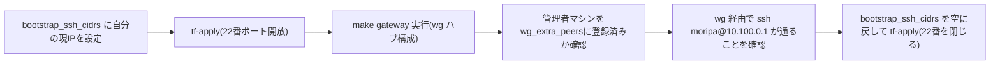

Linode 上に WireGuard ハブ兼出口ゲートウェイ(Nanode)を作成するフェーズ。
実装は `terraform/modules/linode-gateway`、実環境の値は
`terraform/envs/prod` にある。

## 事前準備

```sh
export LINODE_TOKEN=...   # tfvars にトークンは書かない
```

`terraform/envs/prod/terraform.tfvars` に以下を設定する。

| 変数 | 内容 |
|---|---|
| `admin_ssh_keys` | 管理ユーザー(`moripa`)の SSH 公開鍵一覧 |
| `bootstrap_ssh_cidrs` | 初回のみ SSH(22/tcp)を許可する CIDR(自分の現在の `/32`)。定常は空配列 |
| `public_tcp_ports`(デフォルト値のまま) | 外部公開する TCP ポート。`ansible/group_vars/all/network.yml` の `dnat_rules` と一致させる(`make check-consistency` で検査) |

## 実行

```sh
make tf-init
make tf-plan
make tf-apply
make tf-output   # gateway_public_ip を表示
```

`make tf-output` の出力を `ansible/group_vars/all/network.yml` の
`gateway_public_ip` に転記する。

✅ 検証: `ssh moripa@<public_ip>` でログインでき、`cloud-init status` が
`done` になっていること。

## bootstrap_ssh_cidrs: 一時開放と閉じ方



`bootstrap_ssh_cidrs` は Ansible 初回実行(`make gateway`)のために一時的に
開ける値であり、恒常的に開けておくものではない。**閉じる前に**
`/docs/admin/keys` で説明した管理者マシンの WireGuard peer 登録を済ませ、
wg 経由の SSH が通ることを確認してから空配列に戻して再 apply すること。
閉じたあとに wg が壊れた場合の復旧手段は Linode の LISH コンソールのみ。

<Callout title="トークンは環境変数のみ">
  `LINODE_TOKEN` は tfvars に書かず、環境変数として渡す。state はローカル
  管理(gitignore 対象)。
</Callout>
