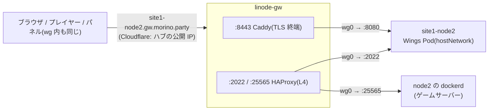

Pelican Wings(ゲームサーバーのデーモン)を **site1-node2** で動かす。Wings 本体は k8s の Pod
(`kubernetes/sites/site1/apps/wings/`、ArgoCD の `wings` Application)で、node2 の
`/var/run/docker.sock` をマウントし、ゲームサーバーは **node2 の dockerd のコンテナ**として起動する。
パネルは別管理(このリポジトリの対象外)。

| 置き場所 | 中身 |
|---|---|
| `ansible/roles/wings_host`(inventory の `wings_nodes`) | docker.io、`/etc/docker/daemon.json`、uid/gid `2988` の `pelican` ユーザー、`/etc/pelican` `/var/lib/pelican` `/var/log/pelican` `/tmp/pelican` |
| `ansible/group_vars/wings_nodes/main.yml` | uid/gid、API / SFTP のポート、ingress フィルタに足すポート |
| `kubernetes/sites/site1/apps/wings/` | Deployment(node2 固定、hostNetwork、イメージはダイジェスト固定)、`config.yml` の Secret(sops) |
| `ansible/group_vars/all/network.yml` | `tcp_routes`(SFTP・ゲーム port)、`proxy_public_ports` の `8443` |
| `gateway/caddy/Caddyfile` | `site1-node2.gw.morino.party:8443` → `10.100.0.12:8080` |

## 経路と DNS



名前は **`site1-node2.gw.morino.party` の 1 つだけ**で、DNS も Cloudflare の A / AAAA(ハブの公開 IP、
DNS only)の 1 か所だけ。wg 内の dnsmasq も上書きせず上流へ転送するので、外からも wg 内からも
同じ答え・同じポートになる。

- wg 内だけ `10.100.0.1` を返す split DNS にはしない。パネル(公開サイト)のページからブラウザが
  プライベート IP へ fetch する形になり、Local Network Access の許可プロンプト・ブロックの対象になる
  (コンソールの WebSocket も同じ)
- ハブの公開 IP は wg の Endpoint なので、wg peer からもトンネルの外を通って直接届く

| port | 受け口(ハブ) | 転送先 |
|---|---|---|
| `8443` | Caddy(Let's Encrypt DNS-01 で TLS 終端) | node2 `:8080`(Wings API、平文) |
| `2022` | HAProxy(`tcp_routes` の `wings-sftp`) | node2 `:2022`(Wings の SFTP) |
| `25565` | HAProxy(`tcp_routes` の `game-25565`) | node2 `:25565`(docker が publish したゲームサーバー) |

node2 の `:8080` / `:2022` は ingress フィルタ(`roles/k8s_prereq`)で wg0 / lo 以外から drop する
(拠点 LAN から直接叩けない)。ゲームサーバーの port は docker の DNAT(forward 経路)なので
このフィルタの対象外。

## docker を k8s ノードに入れていることの注意

- docker.io は k8s と同じ containerd を使う(namespace `moby`)。kubelet は `k8s.io` しか触らない
- `daemon.json` の `ip-forward-no-drop: true` で iptables の FORWARD policy を ACCEPT のまま保つ
  (Cilium の `CILIUM_FORWARD` と共存。`wings_host` が適用後に確認する)。`live-restore: true` なので
  dockerd の再起動でゲームサーバーは止まらない
- ゲームサーバーの CPU / メモリは kubelet から見えない。node2 が重くなったら、k8s の Pod を
  他ノードへ寄せるか kubelet の `systemReserved` を増やす
- ゲームサーバーのデータは `/var/lib/pelican/volumes`(ルート FS。Longhorn の `/data/longhorn` と同じ
  FS なので、Longhorn の `storageReserved` 30GiB を食い込ませないよう容量に注意)
- Wings の Pod を消してもゲームサーバーのコンテナは止まらない(dockerd が持っている)

## 初期設定

1. node2 の前提を入れる(docker 等。`make cluster` にも含まれる):

   ```bash
   cd ansible
   ../.venv/bin/ansible-playbook playbooks/cluster.yml --limit site1-node2 --tags wings,ingress_filter
   ```

2. パネルでノードを作る。
   - FQDN: `site1-node2.gw.morino.party`、SSL を使う、プロキシの後ろ(behind proxy)
   - Wings の listen ポート `8080`、パネル / ブラウザが繋ぐポート `8443`、SFTP `2022`
   - 割り当て(allocation): IP `0.0.0.0`、port `25565`
3. パネルのノードの Configuration に出る `config.yml` を sops で暗号化して
   `kubernetes/sites/site1/apps/wings/secrets.sops.yaml`(Secret `wings-config` の `stringData.config.yml`)に
   置き、push する。`api.port: 8080`、`api.ssl.enabled: false`(TLS はハブの Caddy)、
   `system.sftp.bind_port: 2022` になっていること。編集は `sops kubernetes/sites/site1/apps/wings/secrets.sops.yaml`。

   Wings は起動時に `config.yml` を書き戻すので Secret は直接マウントせず、init コンテナが
   Pod の起動ごとに node2 の `/etc/pelican/config.yml` へコピーする(正は git。node2 上で直接
   編集しても次の再起動で戻る)。Secret を変えたら `kubectl -n wings rollout restart deploy/wings`
   (ArgoCD は Secret の変更で Pod を作り直さない)。
4. 確認:

   ```bash
   kubectl -n wings logs deploy/wings
   curl -sI https://site1-node2.gw.morino.party:8443/api/system   # 401 なら Wings まで届いている
   nc -vz site1-node2.gw.morino.party 2022
   ```

   パネルのノード一覧でハートビートが緑になれば完了。

## ゲーム用のポートを増やす

`network.yml` の `tcp_routes` に `{ name: game-25566, port: 25566, site: site1, hosts: [site1-node2] }`
を足し、`terraform/envs/prod/main.tf` の `public_tcp_ports` にも足す(`make check-consistency` が突合)。
`make gateway` と `make tf-apply` のあと、パネルで allocation を追加する。

## Wings の更新

`wings.yaml` のイメージをリリースタグのダイジェストに差し替えて push する(`latest` は main の
開発ビルドなので使わない)。ダイジェストの調べ方:

```bash
T=$(curl -s "https://ghcr.io/token?scope=repository:pelican/wings:pull" | jq -r .token)
curl -sI -H "Authorization: Bearer $T" \
  -H "Accept: application/vnd.oci.image.index.v1+json" \
  https://ghcr.io/v2/pelican/wings/manifests/<tag> | grep -i docker-content-digest
```
