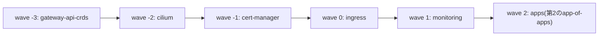

## 拠点ごとに ArgoCD を持つ

各クラスタが自分専用の ArgoCD を self-host する(拠点間で共有しない)。
これにより片拠点が全損してももう片方の GitOps は動き続ける
(設計判断の詳細は `/docs/architecture/overview`)。

## ディレクトリ構造

```
kubernetes/
├── common/                 # 両拠点共通のベース
│   ├── argocd/             # 公式 manifest + ksops パッチ(kustomize)
│   ├── cilium/values.yaml  # Cilium 共通設定(site 側が VIP を上書き)
│   ├── gateway-api-crds/   # Cilium より先に同期(wave -3)
│   └── cert-manager/
└── sites/
    ├── site1/
    │   ├── bootstrap/
    │   │   ├── argocd/         # common/argocd の overlay
    │   │   ├── secrets/        # out-of-band 投入する2 Secret(両拠点で共有鍵)
    │   │   ├── applications/   # site1 の app-of-apps(sync waveで順序制御)
    │   │   └── root-app.yaml
    │   ├── infrastructure/
    │   │   ├── cilium/values.yaml  # k8sServiceHost = site1 の VIP
    │   │   ├── ingress/            # Cilium Gateway API(hostNetwork :80/:443)
    │   │   └── monitoring/
    │   └── apps/
    │       └── minecraft/          # eTP Local + DNAT先ノードにピン
    └── site2/              # site1 と同構造(apps は空の雛形)
```

## app-of-apps と sync wave

`root-app.yaml` を `kubectl apply` すると、`bootstrap/applications/` 配下の
Application 群(第2の app-of-apps)が同期される。同期順序は
`argocd.argoproj.io/sync-wave` アノテーションで制御する。



| wave | Application | 理由 |
|---|---|---|
| -3 | `gateway-api-crds` | Gateway API CRD が無いと Cilium は Gateway 機能をサイレントに無効化し、後入れしても再起動まで有効にならない |
| -2 | `cilium` | CNI。すべてのPod通信の前提 |
| -1 | `cert-manager` | ingress より先にTLS証明書の仕組みを用意 |
| 0 | `ingress` | Cilium Gateway API(hostNetwork、:80/:443) |
| 1 | `monitoring` | 監視 |
| 2 | `apps` | 個別アプリ(minecraft等) |

`root` と `cilium` の Application は `prune: false`(誤削除防止 / CNI破壊防止)。

## Cilium: common + site の2層構成と Ansible との共有

Cilium の values は `kubernetes/common/cilium/values.yaml`(共通)と
`kubernetes/sites/<site>/infrastructure/cilium/values.yaml`(サイト固有、
`k8sServiceHost` = その拠点の kube-vip VIP)の2層。

`cilium` Application は multi-source 構成で、chart は
`https://helm.cilium.io` から、values は Git 上の上記2ファイルを
common → site の順で読む。この順序は **Ansible(`k8s_bootstrap` ロールが
Helm へ渡す `-f` の順序)と完全に一致させてある**。そのため、Ansible が
`make cluster` の最終ステップで投入した Cilium の Helm リリースを、
ArgoCD 導入後は diff ゼロでそのまま引き取れる(手順は
`/docs/admin/argocd`)。この一致は `make check-consistency` が検査する。

<Callout title="values は静的YAMLを保つ">
  Cilium の values ファイルは Jinja テンプレート化しない(禁止)。Ansible
  と ArgoCD の両方が同じファイルをそのまま `-f` で読むための制約。
</Callout>

## ksops による Secret 復号

ArgoCD の `argocd-repo-server` に ksops(kustomize の exec plugin)を
初期化コンテナで組み込み(`kubernetes/common/argocd/repo-server-ksops-patch.yaml`)、
`argocd-cm` で `--enable-alpha-plugins --enable-exec` を有効化している
(`argocd-cm-patch.yaml`)。

repo-server は cluster 用 age 秘密鍵(Secret `sops-age`、bootstrap時に
out-of-band投入)を使って、Git上の `*.sops.yaml` を sync 時にその場で
復号する。これにより、Kubernetes Secret も他のマニフェストと同じ GitOps
経路(kustomize)に載せられる。

bootstrap の2つの Secret(`sops-age` / deploy key)だけは、ArgoCD 自身が
リポジトリを読めるようになる前に必要なため、この仕組みの外側で
`make bootstrap-argocd` が直接投入する(`/docs/admin/argocd` 参照)。
