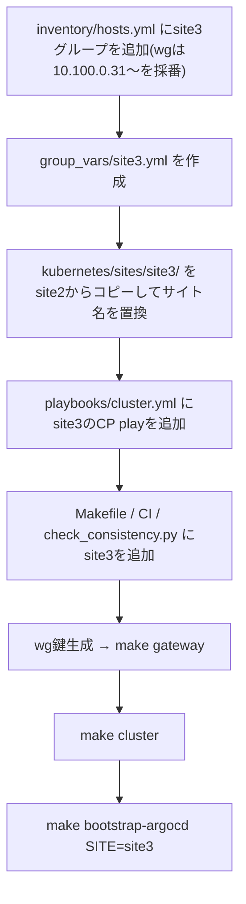

このページは拠点構成を変更・拡張する場合の指針を記す。基本設計は
`/docs/architecture/overview` を参照。

## 重要な制約: Pod / Service CIDR は両拠点で同一値

`10.244.0.0/16` / `10.96.0.0/12` を両クラスタで使い回している。
**クラスタ同士を接続しない前提でのみ成立する**制約であり、設定ファイル上の
都合ではない。

| やりたいこと | 対応 |
|---|---|
| 現状維持(クラスタ間非接続) | 変更不要。CIDR が重複していても各クラスタ内で閉じているため問題ない |
| Cilium Cluster Mesh 等でクラスタ間の Pod 直接通信をしたい | **設定変更ではなく、片方のクラスタの再IP設計(実質作り直し)が必要** |

<Callout title="将来 cluster mesh の予定が少しでもあるなら">
  先に site2(または新設する拠点)の CIDR をずらしておくこと(例:
  Pod CIDR を `10.245.0.0/16` にする)。後から変更するのはクラスタの
  作り直しに等しいコストがかかる。
</Callout>

## 公開サービスと拠点の対応

Linode の `dnat_rules`(`ansible/group_vars/all/network.yml`)の `target`
をどの拠点のノードの wg アドレスにするかで、そのサービスの提供拠点が
決まる。現状はすべて site1。site2 で公開するサービスを追加する場合は
`target` を `10.100.0.2x` 系にして追加する。

Minecraft のような `externalTrafficPolicy: Local` + node ピン構成では、
Pod の `nodeSelector` と `dnat_rules` の `target` の対応関係を
`make check-consistency` が検査する(詳細は `/docs/admin/operations` の
DNAT フェイルオーバー手順)。

## 拠点を追加する場合(site3 の例)

1. `ansible/inventory/hosts.yml` に site3 グループを追加(wg は
   `10.100.0.31`〜 を採番)
2. `ansible/group_vars/site3.yml` を作成(`lan_cidr` / `kube_vip_address` /
   グループ名 / values パス)
3. `kubernetes/sites/site3/` を site2 からコピーしてサイト名を置換
4. `ansible/playbooks/cluster.yml` に site3 の control-plane 構築 play を追加
5. `Makefile` の `KUSTOMIZE_DIRS`、CI の kustomize リスト、
   `scripts/check_consistency.py` の `SITES` に site3 を追加
6. wg 鍵生成 → `make gateway`(ハブの peer が増える)→ `make cluster` →
   `make bootstrap-argocd SITE=site3`

## 既存拠点のクラスタに worker を足す場合

inventory の `site<N>_workers`(現状は空グループ)にホストを追加して
wg 鍵を生成し、`make cluster` を再実行するだけでよい(kubeadm の join は
冪等なため、既存ノードへの再実行は無害)。
