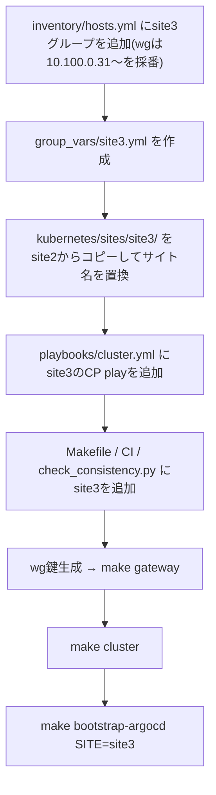

このページは拠点構成を変更・拡張する場合の指針を記す。基本設計は
`/docs/architecture/overview` を参照。

## 重要な制約: Pod / Service CIDR は両拠点で同一値

`10.244.0.0/16` / `10.96.0.0/12` を両クラスタで使い回している。
**クラスタ同士を接続しない前提でのみ成立する**制約であり、設定ファイル上の
都合ではない。

| やりたいこと | 対応 |
|---|---|
| 現状維持(クラスタ間非接続) | 変更不要。CIDR が重複していても各クラスタ内で閉じているため問題ない |
| Cilium Cluster Mesh 等でクラスタ間の Pod 直接通信をしたい | **設定変更ではなく、片方のクラスタの再IP設計(実質作り直し)が必要** |

<Callout title="将来 cluster mesh の予定が少しでもあるなら">
  先に site2(または新設する拠点)の CIDR をずらしておくこと(例:
  Pod CIDR を `10.245.0.0/16` にする)。後から変更するのはクラスタの
  作り直しに等しいコストがかかる。
</Callout>

## 公開サービスと拠点の対応

### HTTP/HTTPS: `proxy_routes`(Caddy)

`ansible/group_vars/all/network.yml` の `proxy_routes` に
`{ host, site }` を追加すると、Linode 上の Caddy がそのホスト名を
`site` の全ノード `:80`(Cilium Gateway)へ転送する。手順:

1. DNS でホスト名を `gateway_public_ip` に向ける(先にやらないと
   Caddy の証明書取得が失敗し続ける)
2. `proxy_routes` に `{ host: "app.morino.party", site: site2 }` を追加して
   `make gateway`
3. 対象拠点のクラスタに、その `hostnames` を持つ HTTPRoute を
   `kubernetes/sites/<site>/apps/` に追加(Gateway `public` を parentRef に)

upstream は inventory から自動導出されるため、ノードの増減で `proxy_routes`
を触る必要はない。

### L4(Minecraft 等): `tcp_routes`(HAProxy)

`tcp_routes` に `{ name, port, site, node_port, allowed_sources }` を追加すると、
Linode 上の HAProxy がその port を `site` の全ノードの NodePort へ転送する。
現状は site1 の Minecraft(25565 → NodePort 30565)のみ。site2 にも Minecraft を
置くなら別の port(例: 25566)で行を足し、`terraform` の `public_tcp_ports`
にもポートを足す。Velocity 側はバックエンドごとに `Linode の IP:port` を
登録する。`allowed_sources` に Velocity の IP を入れて、バックエンドへの
直接接続を防ぐこと。

## 拠点を追加する場合(site3 の例)

1. `ansible/inventory/hosts.yml` に site3 グループを追加(`wg_address` は
   `10.100.0.31`〜、`lan_address` は `10.200.3.11`〜 を採番。node1 を
   `site3_control_plane`、node2 を `site3_workers` に)
2. `ansible/group_vars/site3.yml` を作成(`cluster_lan_cidr` = `10.200.3.0/24` /
   `kube_vip_address` = `10.200.3.10` / グループ名 / values パス)
3. `kubernetes/sites/site3/` を site2 からコピーしてサイト名を置換
4. `ansible/playbooks/cluster.yml` に site3 の control-plane 構築 play を追加
5. `Makefile` の `KUSTOMIZE_DIRS`、CI の kustomize リスト、
   `scripts/check_consistency.py` の `SITES` に site3 を追加
6. wg 鍵生成 → `make gateway`(ハブの peer が増える)→ `make cluster` →
   `make bootstrap-argocd SITE=site3`

## 既存拠点のクラスタにノードを足す場合

予備マシン(`site<N>_spare`、現状 node3 / node4)は wg 鍵・ハブのピア・DNS・
bootstrap スクリプトだけ先に用意してあり、クラスタと Caddy / HAProxy の転送先
には入らない。投入するときは inventory の行を `site<N>_spare` から
`site<N>_workers` へ移して `make gateway`(転送先の更新)と `make cluster` を
実行する。予備に無い新規マシンを足すなら、inventory に追加(`wg_address` と
`lan_address` を採番)して `make wg-keygen HOST=...` → `make gateway` →
`make node-bootstrap HOST=...` → 現地で実行 → `make cluster`。
`make cluster` は再実行するだけでよい
(kubeadm の join は冪等なため、既存ノードへの再実行は無害)。Caddy の
upstream は inventory から導出されるため自動で追加される。

control-plane を足して etcd を冗長化したい場合は `site<N>_control_plane` に
追加する(`controlPlaneEndpoint` は kube-vip の VIP なので再構築は不要)。
ただし etcd は**奇数メンバー**でないと意味がないため、2 CP ではなく
3 CP(3台目を追加)にすること。
