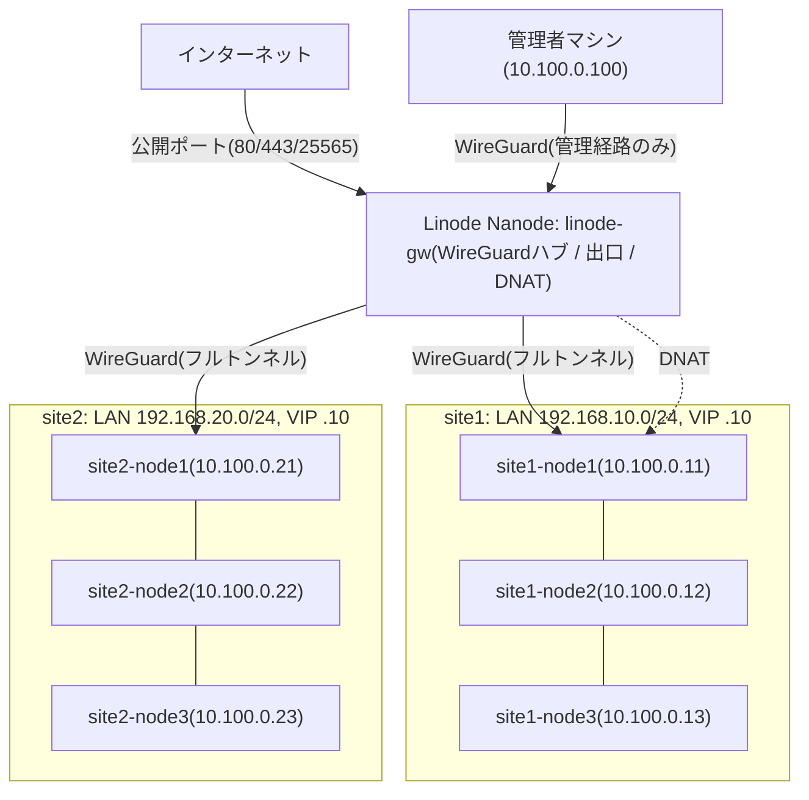

このリポジトリは**2拠点・拠点ごとに独立した Kubernetes クラスタ**を実装
している。このページはその設計判断を記す。個別の技術要素(WireGuard の
詳細、GitOps 構成など)は他ページを参照。

## 全体トポロジ

各拠点は3台全部が control-plane(stacked etcd)かつ schedulable な独立クラスタ。
拠点間にクラスタレベルの接続はなく、障害ドメインは完全に分離されている。

## なぜ「1クラスタを2拠点に跨がせる」のではないのか

| 理由 | 説明 |
|---|---|
| etcd クォーラム | 2拠点構成では過半数を持つ側が落ちるとクラスタ全体が停止する。タイブレーカーになる第3拠点がなく、対称な冗長化が原理的に不可能(Nanode は非力すぎて etcd メンバーには不適) |
| 拠点間リンクへの依存 | 跨がせると etcd / API / Pod 通信が拠点間トンネルの品質に常時依存する。独立クラスタなら拠点間リンク断でも両拠点とも無傷 |
| 障害ドメインの分離 | ArgoCD も拠点ごとに持つ。片拠点が全損しても、もう片方の GitOps は動き続ける |

## 構成の要点

| 項目 | site1 | site2 |
|---|---|---|
| LAN CIDR | `192.168.10.0/24` | `192.168.20.0/24` |
| kube-vip VIP | `192.168.10.10` | `192.168.20.10` |
| wg アドレス | `10.100.0.11`–`13` | `10.100.0.21`–`23` |
| ノード | site1-node1〜3(全部 CP) | site2-node1〜3(全部 CP) |

- WireGuard は Linode をハブとする hub-and-spoke。両拠点の全ノードが
  spoke であり、拠点間に直接トンネルは張らない(詳細は
  `/docs/architecture/wireguard`)
- ArgoCD は各クラスタが自分の分を self-host する(詳細は
  `/docs/architecture/gitops`)
- 管理者は wg 経由で両拠点のノード・API へ到達できる(kubeadm の
  certSANs に各ノードの wg アドレスを含めてある)
- 外部公開は Linode 側の DNAT でトンネル越しに対象拠点のノードへ転送する。
  現状はすべて site1 向け

<Callout title="Pod / Service CIDR は両拠点で同一値">
  クラスタ同士を接続しない前提でのみ成立する制約。詳細と、将来 cluster
  mesh 等で接続したくなった場合の対応は `/docs/architecture/multi-site`
  を参照。
</Callout>
