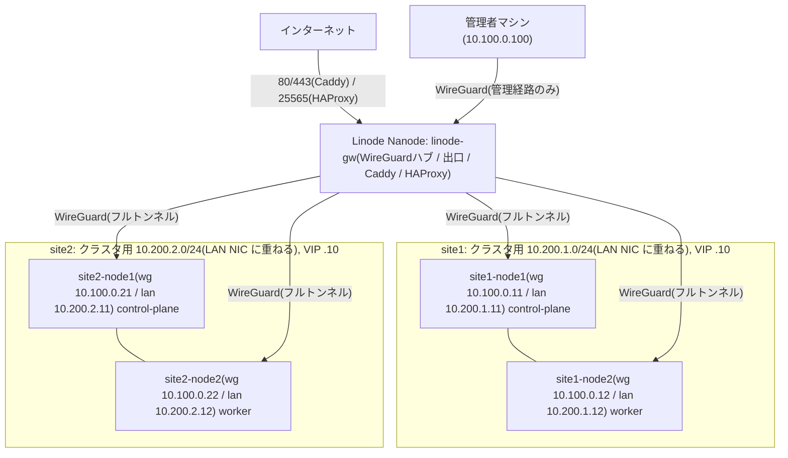

このリポジトリは**2拠点・拠点ごとに独立した Kubernetes クラスタ**を実装
している。このページはその設計判断を記す。個別の技術要素(WireGuard の
詳細、GitOps 構成など)は他ページを参照。

## 全体トポロジ

各拠点は node1 が control-plane(stacked etcd、schedulable)、node2 が worker の
2台構成の独立クラスタ。拠点間にクラスタレベルの接続はなく、障害ドメインは
完全に分離されている。クラスタ内通信は拠点の LAN で直接行い、Linode を
経由しない。

<Callout title="各拠点のクラスタは HA ではない" type="warn">
  control-plane が 1台(etcd 1メンバー)のため、node1 が落ちると API サーバーは
  止まる(node2 上の Pod は動き続ける)。etcd スナップショットの定期取得が
  必須で、node1 の全損はバックアップからの復旧になる。2台構成では
  2台とも control-plane にしても etcd のクォーラム(過半数)は 1台障害で
  失われるため冗長性は得られず、あえて 1 CP + 1 worker にしている。
  kube-vip の VIP は「固定の API アドレス(Cilium の `k8sServiceHost` と
  `controlPlaneEndpoint`)」と将来の CP 追加余地のために置いてあり、
  フェイルオーバー目的ではない。
</Callout>

<Callout title="LAN は DHCP のまま、クラスタ用の第 2 サブネットを重ねる">
  拠点はアパートでルーターを触れず、LAN の IP を固定できる保証がない。
  kubeadm / kube-vip / Cilium は固定アドレスを前提にするため、Ansible が
  ルーターと無関係なサブネット(`cluster_lan_cidr` = `10.200.<site>.0/24`)の
  固定アドレス(`lan_address`)を LAN NIC に**追加**し、クラスタはそのアドレス
  だけを使う。DHCP で貰うアドレスはインターネット向け(wg のエンドポイント)に
  そのまま残す。同じスイッチ配下の 2 台は直接 ARP で通信できるので、ルーターの
  設定も DHCP プールの範囲も関係ない。前提は「2 台が同じルーター/スイッチの
  有線ポートにつながっている」ことだけ(詳細は `/docs/architecture/wireguard`)。
</Callout>

## なぜ「1クラスタを2拠点に跨がせる」のではないのか

| 理由 | 説明 |
|---|---|
| etcd クォーラム | 2拠点構成では過半数を持つ側が落ちるとクラスタ全体が停止する。タイブレーカーになる第3拠点がなく、対称な冗長化が原理的に不可能(Nanode は非力すぎて etcd メンバーには不適) |
| 拠点間リンクへの依存 | 跨がせると etcd / API / Pod 通信が拠点間トンネルの品質に常時依存する。独立クラスタなら拠点間リンク断でも両拠点とも無傷 |
| 障害ドメインの分離 | ArgoCD も拠点ごとに持つ。片拠点が全損しても、もう片方の GitOps は動き続ける |

## 構成の要点

| 項目 | site1 | site2 |
|---|---|---|
| クラスタ用サブネット(`cluster_lan_cidr`) | `10.200.1.0/24` | `10.200.2.0/24` |
| kube-vip VIP | `10.200.1.10` | `10.200.2.10` |
| `lan_address` | node1 `.11` / node2 `.12` | 同左 |
| wg アドレス | `10.100.0.11`–`12` | `10.100.0.21`–`22` |
| ノード | site1-node1(CP)/ site1-node2(worker) | site2-node1(CP)/ site2-node2(worker) |

- WireGuard は Linode をハブとする hub-and-spoke。両拠点の全ノードが
  spoke であり、拠点間に直接トンネルは張らない。同一拠点のノード間通信は
  LAN 直通でトンネルに乗せない(詳細は `/docs/architecture/wireguard`)
- ArgoCD は各クラスタが自分の分を self-host する(詳細は
  `/docs/architecture/gitops`)
- 管理者は wg 経由で両拠点のノード・API へ到達できる。VIP は wg から
  届かないため、管理者の kubeconfig は node1 の wg アドレス
  (`https://10.100.0.11:6443` / `https://10.100.0.21:6443`。certSANs に含めてある)を使う
- HTTP/HTTPS の公開は Linode 上の Caddy がホスト名ごとに対象拠点の全ノード
  :80(Cilium Gateway)へトンネル越しに転送する(TLS 終端、ノード障害時の
  自動切替、両拠点を 1か所で扱える)。Minecraft など L4 のサービスは
  HAProxy が対象拠点の NodePort へ転送する(詳細は `/docs/architecture/wireguard`)

<Callout title="Pod / Service CIDR は両拠点で同一値">
  クラスタ同士を接続しない前提でのみ成立する制約。詳細と、将来 cluster
  mesh 等で接続したくなった場合の対応は `/docs/architecture/multi-site`
  を参照。
</Callout>
