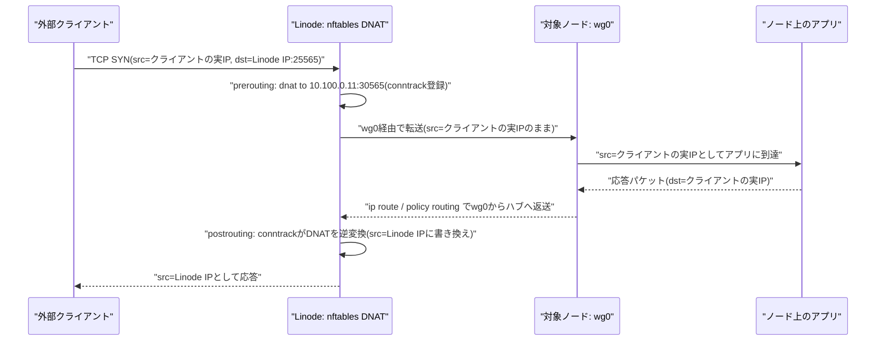

## 目的

1. 6台のノードの**外向き通信を Linode の固定IPから出す**(自宅回線のIPを晒さない)
2. 外部からのアクセスを Linode で受けて**DNAT でノードへ転送**する(サービス公開)
3. 管理用の踏み台経路(SSH over wg)を提供する

<Callout title="Cilium のノード間暗号化とは別物">
  これは Cilium のノード間 WireGuard 暗号化(`encryption.type=wireguard`)
  とは別物。あちらはクラスタ内 Pod 通信の暗号化で、このトンネルは南北
  (external)トラフィック用。混同しないこと(併用は可能)。
</Callout>

## トポロジ: hub-and-spoke

| ホスト | wg アドレス | 役割 |
|---|---|---|
| linode-gw | `10.100.0.1/24` | ハブ。ListenPort 51820。IP forward + masquerade |
| site1-node1–3 | `10.100.0.11–13/32` | spoke。NAT 裏なので `PersistentKeepalive = 25` |
| site2-node1–3 | `10.100.0.21–23/32` | spoke。同上 |
| 管理者マシン | `10.100.0.100/32` | spoke(`wg_extra_peers`)。SSH / kubectl 用の管理経路 |

同一拠点のノード同士は wg 経由で通信**しない**(拠点 LAN で直接通信)。
拠点間はクラスタレベルで接続しないため、拠点間トンネルも張らない。
ハブ側の `AllowedIPs` は各 peer の `/32` のみ。

## 最重要の設計制約: k8s トラフィックをトンネルに乗せない

ノード側を安易に `AllowedIPs = 0.0.0.0/0` にすると、etcd・kubelet・Pod間
通信まで Nanode 経由になりクラスタが実用にならない。ただし
**wg-quick のフルトンネル機構はこれを自然に回避できる**。

- wg-quick は `0.0.0.0/0` 指定時、default route の差し替えではなく
  **fwmark + ポリシールーティング**(table 51820 + `suppress_prefixlength 0`
  ルール)を使う
- `suppress_prefixlength 0` により、**main テーブルにより具体的な経路が
  あればそちらが勝つ**。つまり:
  - LAN 内ノード間通信 → connected route(`<LAN CIDR> dev <LAN NIC>`)が
    勝つ → 直接通信
  - Pod CIDR → Cilium が main テーブルに入れる経路(native routing)、
    または VXLAN 外側パケットがノードIP宛(= LAN 経路)になる → 直接通信
  - それ以外の外向き → table 51820 の default → wg0 経由

依存関係として明示しておく: **「ノード間トラフィックが LAN に留まる」こと
が Pod MTU に影響が出ない条件**。もしノードが別セグメントに分散したら
MTU と経路設計を見直す必要がある。

安全側に倒すため、spoke 設定には LAN / Pod / Service CIDR の除外経路を
`PostUp` で明示的にも入れてある(冪等なので二重でも害はない)。

## MTU

- `wg0` は **MTU 1420**(1500 − 80: WireGuard オーバーヘッド + 余裕)
- クラスタ内(Cilium)の MTU はトンネルを通らないため影響を受けない
  (上記の依存関係を参照)

## パケットフロー: 外部クライアントから実IPが保持される仕組み

DNAT + フルトンネルの組み合わせでも、公開サービスから見たクライアントの
接続元は SNAT されない実IPのまま残る。その仕組みは往路と復路で異なる。



ポイント:

- **往路で送信元IPは一切書き換えない**。nftables の DNAT は宛先(dst)のみ
  を書き換えるため、ノード上のアプリからはクライアントの実IPがそのまま
  見える
- **復路は conntrack が自動でDNATを逆変換する**。アプリは
  「クライアントの実IP宛」に返信するだけでよく、Linode 側で
  conntrack テーブルを参照して送信元をLinodeのIPに戻す(= SNATは
  conntrackによる逆変換であり、明示的なSNATルールは不要)
- ノード側の **rp_filter が strict(1)のままだと**、wg0 から着信した
  「src=クライアントの実IP」のパケットが reverse path 検査で破棄される。
  そのため **rp_filter は loose(2)** に設定する

## nftables 設定例(ハブ)

`ansible` の `wireguard` ロールが `dnat_rules` 変数から生成する。

```txt
table inet nat {
  chain postrouting {
    type nat hook postrouting priority srcnat;
    oifname "eth0" ip saddr 10.100.0.0/24 masquerade
  }
  chain prerouting {
    type nat hook prerouting priority dstnat;
    # 例: Minecraft を node1 の NodePort へ公開
    iifname "eth0" tcp dport 25565 dnat ip to 10.100.0.11:30565
  }
}
table inet filter {
  chain forward {
    type filter hook forward priority filter;
    # Pod egress は wg0(MTU 1420)を通るためTCPのMSSをclampする
    # (クラスタ内MTU 1450のパケットがブラックホール化するのを防ぐ)
    tcp flags syn tcp option maxseg size set rt mtu
    ct state established,related accept
  }
}
```

`sysctl net.ipv4.ip_forward=1` を忘れないこと。

## 鍵の管理と運用

- 秘密鍵は sops + age で暗号化して `ansible/host_vars/<host>/` に格納
  (`wg genkey` で生成、公開鍵は平文でよい)。鍵の一覧は
  `/docs/admin/keys` を参照
- spoke は NAT 裏のため keepalive 必須。ハブ再起動後も spoke 側から
  再接続される
- 設定変更の反映は **`wg syncconf`**(handler)で行い、`wg-quick@wg0
  restart` は使わない。フルトンネル確立後の restart は自分の管理セッションや
  DNAT 経由の接続を切断するため。`Address` / `MTU` / `PostUp` などの
  Interface 行を変えた場合のみ計画的に restart する
- 疎通確認は `wg show` の handshake、`ping 10.100.0.1`、
  `curl ifconfig.me` が Linode のIPを返すことで行う
- クラスタ健全性の確認として、`ip route get <他ノードのLAN IP>` が
  `dev eth0`(LAN 直通)を返すことをセットアップ後に必ず確認する
