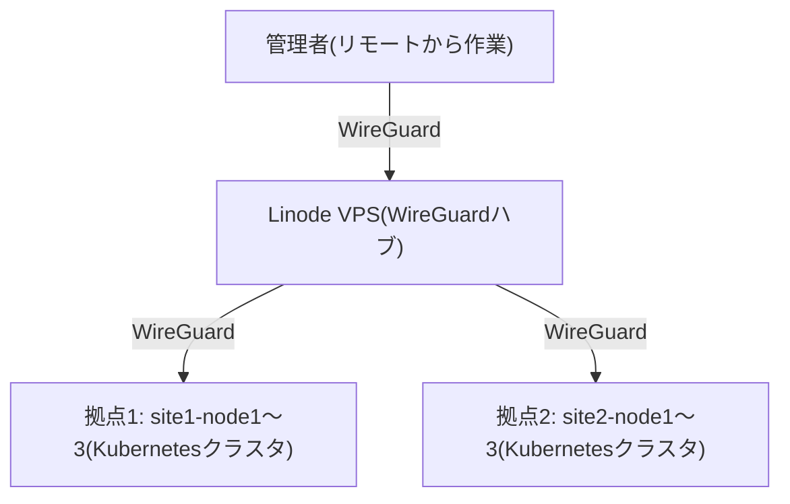

このサイトは、もりのパーティのサーバーインフラに関するドキュメントです。
サーバーは**2つの拠点**(site1 / site2)に設置されていて、それぞれが独立した
Kubernetes クラスタとして動いています。拠点の外との出入り口として、
Linode 上の VPS が WireGuard のハブ(中継地点)になっています。

現地のサーバーがインターネットに繋がりさえすれば、WireGuard 経由で管理者の
いる場所からリモートで残りの設定ができる仕組みになっています。そのため、
現地での作業は「サーバーを設置して、最低限のネットワーク設定をして、
インターネットに繋がることを確認する」ところまでです。

## あなたはどちらですか?

<Cards>
  <Card
    title="現地作業者向け"
    description="サーバーの設置・配線・OSインストール・ネットワーク設定を行う方はこちら"
    href="/docs/onsite"
  />
  <Card
    title="管理者向け"
    description="リモートでの構成・運用・トラブル対応を行う方はこちら"
    href="/docs/admin"
  />
</Cards>

インフラの詳しい設計(ネットワーク設計、Kubernetes構成、GitOpsなど)を
知りたい方は、設計資料のセクションをご覧ください。
