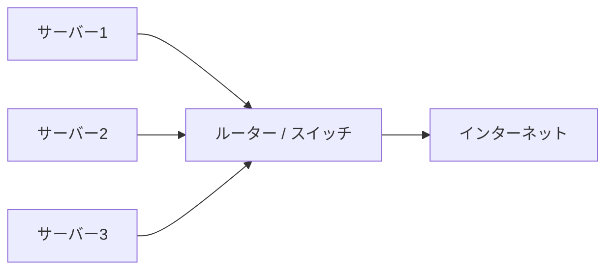

このページでは、サーバーを置いて、ケーブルをつなぎ、電源を入れるところまでを
説明します。難しい作業は何もありません。1つずつ順番に進めれば大丈夫です。

## 置き場所を決める

サーバーを置く場所は、以下の点に気をつけて選んでください。

| 確認すること | 理由 |
|---|---|
| 風通しが良い場所か | サーバーは動作中に熱を持つため、熱がこもらない場所を選びます |
| ホコリが少ない場所か | ホコリは故障の原因になるため、床に直置きせず、棚の上などに置くのがおすすめです |
| 近くにコンセントがあるか | 電源タップを使う場合も、延長コードの取り回しが無理なく届く距離にしてください |
| 水濡れの心配がない場所か | 水回りの近くや、結露しやすい場所は避けてください |
| ぐらつかない安定した台の上か | 振動や転倒を防ぐため、平らで安定した場所に置いてください |

<Callout title="難しく考えなくて大丈夫です">
  一般的なパソコンやルーターを置くときの注意点と同じです。
  「風通しの良い、安定した、ホコリの少ない場所」であれば問題ありません。
</Callout>

## 配線する

サーバー3台を、次の図のようにルーター(またはスイッチ)につなぎます。

手順は次のとおりです。

1. LANケーブルの片方をサーバー背面のLANポートに挿します
2. もう片方をルーター(またはスイッチ)の空いているポートに挿します
3. これをサーバー3台すべてで繰り返します
4. 電源タップをコンセントに挿し、サーバーの電源ケーブルを電源タップに挿します

<Callout title="ケーブルの挿し先を間違えても壊れません">
  LANケーブルと電源ケーブルは、それぞれ形が違うポートにしか挿さらないように
  なっています。無理に挿し込まなければ、間違った場所に挿してしまう心配は
  ありません。
</Callout>

## 電源を入れる

配線が終わったら、サーバー本体の電源ボタンを押します。

- サーバー3台とも、順番に電源ボタンを押してください(同時でも順番でも問題ありません)
- 電源が入ると、本体前面や側面のランプが点灯・点滅します
- LANポートの部分のランプ(緑や橙色など)が点灯していれば、ネットワークにも
  正しくつながっています

ランプが点灯していることを確認したら、このページの作業は完了です。
次は [OSのインストール](/docs/onsite/os-install) に進んでください。

<Callout title="うまくいかないときは">
  電源が入らない、ランプが一切点灯しないといった場合は、無理に分解したり
  せず、配線と電源タップの通電だけ確認したうえで管理者に連絡してください。
</Callout>
