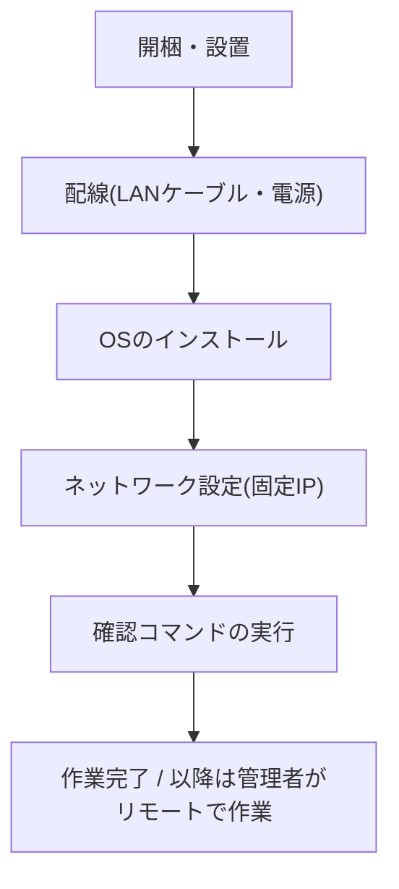

このページは、サーバーを設置する現地作業を担当する方向けの案内です。
専門的な知識がなくても大丈夫です。この後のページに書いてある手順を
順番どおりに進めれば作業は完了します。分からないことがあれば、
無理に自分で解決しようとせず、いつでも管理者に連絡してください。

## 作業の流れ

現地でやることは、大きく分けて次の5つのステップです。

それぞれの詳しいやり方は、このあとのページで1つずつ説明します。

<Cards>
  <Card
    title="1. 設置と配線"
    description="サーバーの置き場所とケーブルのつなぎ方"
    href="/docs/onsite/hardware"
  />
  <Card
    title="2. OSのインストール"
    description="Ubuntu Server のインストール手順"
    href="/docs/onsite/os-install"
  />
  <Card
    title="3. ネットワーク設定"
    description="固定IPの設定と、最後の確認作業"
    href="/docs/onsite/network"
  />
</Cards>

## 作業前に準備するもの

作業を始める前に、以下のものが揃っているか確認してください。

| 準備するもの | 用途 |
|---|---|
| サーバー本体 3台 | 設置するサーバー本体です |
| LANケーブル(3本以上) | サーバーとルーター(スイッチ)をつなぎます |
| 電源タップ | サーバー3台分の電源を確保します |
| USBメモリ | Ubuntu Server のインストールに使います(すでに書き込み済みのものを管理者から受け取っている場合はそのまま使えます) |
| モニター + キーボード | インストール作業やコマンド入力に使います |
| 管理者からの情報メモ | ホスト名・IPアドレス・パスワード・ブートストラップコマンドなど、作業に必要な情報が書かれたメモです |

<Callout title="情報メモは必ず用意してください">
  ホスト名(例: site1-node1)や固定IPアドレス、パスワード、あとで実行する
  コマンドは、すべて管理者から個別に渡されます。このドキュメントには
  実際の値は書かれていないので、必ず事前に受け取っておいてください。
</Callout>

## どこまでやれば完了か

現地作業のゴールは、次の3つがすべてできた状態です。

1. サーバー3台の設置と配線が終わっている
2. サーバー3台すべてで Ubuntu Server のインストールが終わり、ログインできる
3. サーバー3台すべてで固定IPの設定が終わり、インターネットに繋がることを
   確認したうえで、管理者から渡されたブートストラップコマンドを実行して
   「接続できた」ことを確認できている

ここまで終われば現地作業は完了です。それ以降のサーバーの詳しい設定は、
すべて管理者がリモートから行いますので、現地での追加作業は必要ありません。
