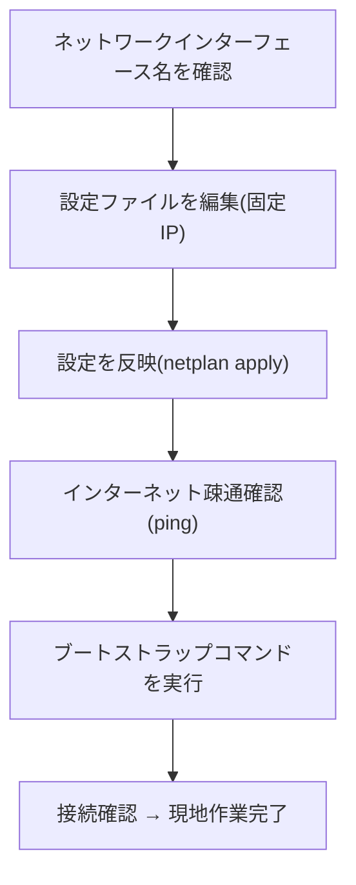

このページが現地作業の最後のステップです。サーバーに固定のIPアドレスを
設定し、インターネットに繋がることを確認したうえで、管理者から渡された
コマンドを実行します。それが終われば現地作業は完了です。

<Callout title="このページの数値はすべて「例」です">
  このページに出てくる `192.168.10.11` のようなIPアドレスは、あくまで
  site1-node1 の場合の例です。実際に自分の担当するサーバーに設定する値は、
  必ず管理者から渡された情報メモに書かれている値を使ってください。
</Callout>

## 全体の流れ



## 1. ネットワークインターフェース名を確認する

まず、サーバーのLANポートに割り当てられている名前(インターフェース名)を
確認します。ログイン後、以下のコマンドを実行してください。

```
moripa@site1-node1:~$ ip a
```

`enp1s0` や `eth0` のような名前が表示されます。この名前は、次の手順で
設定ファイルに書き込むので覚えておいてください(このページでは例として
`enp1s0` を使います)。

## 2. 固定IPの設定ファイルを編集する

Ubuntu Server では、ネットワーク設定は netplan という仕組みで管理されて
います。インストール時に作成された設定ファイルを編集します。まず、
以下のコマンドで設定ファイルの場所を確認してください。

```
moripa@site1-node1:~$ ls /etc/netplan/
00-installer-config.yaml
```

このファイルを、管理者から渡されたエディタの使い方(`nano` など)で
開いてください。

```
moripa@site1-node1:~$ sudo nano /etc/netplan/00-installer-config.yaml
```

中身を、次の例のように書き換えます(値はすべて管理者からの情報メモの
とおりに読み替えてください)。以下は site1-node1 の場合の例です。

```yaml
network:
  version: 2
  ethernets:
    enp1s0:
      dhcp4: no
      addresses:
        - 192.168.10.11/24
      routes:
        - to: default
          via: 192.168.10.1
      nameservers:
        addresses:
          - 192.168.10.1
```

各項目の意味は以下のとおりです。

| 項目 | 意味 | 例 |
|---|---|---|
| `enp1s0` | 手順1で確認したインターフェース名 | `enp1s0` |
| `addresses` | このサーバーに割り当てる固定IPアドレス | `192.168.10.11/24` |
| `routes` / `via` | 拠点のルーターのIPアドレス(デフォルトゲートウェイ) | `192.168.10.1` |
| `nameservers` | DNSサーバーのIPアドレス(通常はルーターと同じ) | `192.168.10.1` |

書き換えが終わったら、保存してエディタを閉じてください(`nano` の場合は
`Ctrl+O` で保存、`Enter` で確定、`Ctrl+X` で終了です)。

## 3. 設定を反映する

以下のコマンドで、編集した設定を反映させます。

```
moripa@site1-node1:~$ sudo netplan apply
```

反映後、もう一度 `ip a` を実行し、設定した固定IPアドレスが表示されている
ことを確認してください。

```
moripa@site1-node1:~$ ip a
...
2: enp1s0: ...
    inet 192.168.10.11/24 ...
```

<Callout title="ここで画面が固まったように見えても慌てないでください">
  リモートデスクトップやSSHで接続しながら作業している場合、IPアドレスが
  変わった瞬間に一時的に反応がなくなることがあります。ここでの作業は
  サーバーに直接モニターとキーボードをつないで行うため、通常は問題
  ありません。
</Callout>

## 4. インターネットに繋がることを確認する

以下のコマンドを実行し、インターネットに疎通していることを確認します。

```
moripa@site1-node1:~$ ping 1.1.1.1
```

以下のように応答が返ってくれば成功です。`Ctrl+C` で止めてください。

```
PING 1.1.1.1 (1.1.1.1) 56(84) bytes of data.
64 bytes from 1.1.1.1: icmp_seq=1 ttl=57 time=8.23 ms
64 bytes from 1.1.1.1: icmp_seq=2 ttl=57 time=7.98 ms
^C
--- 1.1.1.1 ping statistics ---
2 packets transmitted, 2 received, 0% packet loss
```

`Destination Host Unreachable` や応答が一切返ってこない場合は、
`addresses` や `via` の値、LANケーブルの接続を見直してください。

## 5. ブートストラップコマンドを実行する

インターネットへの疎通が確認できたら、最後に管理者から渡された
「ブートストラップコマンド」を実行します。これは1行のコマンドで、
これを実行することでサーバーが管理者のもとへWireGuardで接続し、
以降はリモートで管理できるようになります。

コマンドの中身については気にする必要はありません。管理者から渡された
コマンドを、そのままコピーして端末に貼り付け、実行してください。

```
moripa@site1-node1:~$ (管理者から渡されたコマンドをここに貼り付けて実行します)
```

実行後、`Connected` や `success` といった表示が出れば、正常に接続できて
います。表示されるメッセージの詳細は管理者からの案内に従ってください。

## 現地作業の完了

ここまで完了したら、このサーバーについての現地作業はすべて終わりです。
残りの設定(Kubernetesのセットアップなど)は、すべて管理者がリモートから
行います。他のサーバーが残っている場合は、同じ手順を繰り返してください。

<Callout title="困ったときは">
  途中でうまくいかない、表示されるメッセージの意味が分からないといった
  場合は、無理に自己判断で進めず、そのままの状態で管理者に連絡してください。
  画面の様子(エラーメッセージなど)を写真で共有してもらえるとスムーズです。
</Callout>
