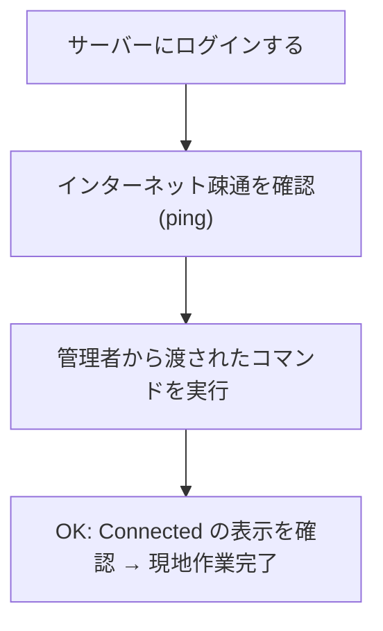

OS のインストールが終わったら、あとは「インターネットに繋がっているか確認して、
管理者から渡されたコマンドを1つ実行する」だけです。

<Callout title="IP アドレスの設定は不要です">
  ネットワークの設定はすべて自動(DHCP)です。IP アドレスなどを手で入力する
  作業はありません。LAN ケーブルがルーターに繋がっていれば、起動するだけで
  自動的にネットワークに参加します。
</Callout>

## 全体の流れ



## 1. サーバーにログインする

モニタとキーボードをつないだまま、インストール時に設定したユーザー
`moripa` とパスワードでログインしてください。

```
site1-node1 login: moripa
Password: (管理者から渡されたパスワード)
```

## 2. インターネットに繋がっているか確認する

次のコマンドを入力して Enter を押してください。

```
moripa@site1-node1:~$ ping -c 3 1.1.1.1
```

次のように `3 received` と表示されれば、インターネットに繋がっています。

```
3 packets transmitted, 3 received, 0% packet loss
```

<Callout type="warn" title="繋がらないとき">
  `100% packet loss` などと表示される場合は、LAN ケーブルがサーバーと
  ルーターの両方にしっかり刺さっているか確認してください。それでもダメな
  場合は、ルーターの電源を入れ直してから数分待って、もう一度試してください。
  解決しなければ管理者に連絡してください。
</Callout>

## 3. 管理者から渡されたコマンドを実行する

最後に、管理者から渡された「ブートストラップコマンド」を実行します。
これを実行すると、サーバーが管理者のもとへ安全な通信路(WireGuard)で
接続し、以降の設定はすべて管理者がリモートでできるようになります。

コマンドの中身については気にする必要はありません。渡されたものを
そのままコピーして端末に貼り付け、実行してください。

```
moripa@site1-node1:~$ (管理者から渡されたコマンドをここに貼り付けて実行します)
```

実行の最後に次のように表示されれば成功です。

```
OK: Connected - 現地作業は完了です。管理者に連絡してください。
```

## 現地作業の完了

ここまでできたら、そのサーバーの現地作業は**すべて完了**です。
モニタとキーボードは外して構いません。3台とも同じ手順を繰り返し、
すべて終わったら管理者に「終わったよ」と連絡してください。

<Callout title="おつかれさまでした">
  以降の設定(IP アドレスの固定を含む)は、管理者がすべてリモートで行います。
  現地で追加の作業をお願いすることはありません。
</Callout>
