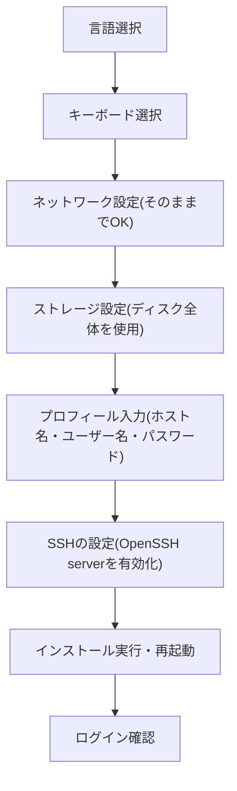

このページでは、サーバーに Ubuntu Server 26.04.1 LTS をインストールする手順を
説明します。インストーラーの画面に沿って、順番に選んでいくだけです。
迷ったときは、このページに書かれている選択肢どおりに進めれば問題ありません。

## 準備

管理者から受け取った Ubuntu Server 26.04.1 LTS のインストール用USBメモリを
サーバーに挿し、モニターとキーボードを接続してから電源を入れます。
USBメモリから起動しない場合は、起動時のメニュー(BIOS/UEFI画面)から
起動デバイスとしてUSBメモリを選んでください。

## インストールの流れ



## 手順

### 1. 言語選択

`English` を選んでください(日本語も選べますが、今後のコマンド操作や
エラーメッセージが英語表記であることが多いため、English を推奨します)。

### 2. キーボードレイアウト

使用しているキーボードに合わせて選択してください。分からない場合は
`English (US)` のままで問題ありません。

### 3. ネットワーク設定

この画面では何もしなくて大丈夫です。IP アドレスは自動(DHCP)で
割り当てられるので、そのまま次に進んでください。手動で IP を設定する
必要は今後もありません。

### 4. ストレージ設定

「ディスク全体を使用する」を選択してください。LVM(Logical Volume
Manager)を使うかどうかの選択肢が出た場合は、デフォルトのまま
(LVMを使う設定のまま)進めて問題ありません。

<Callout title="既存のデータがある場合は要注意">
  この選択をすると、ディスクの中身はすべて消えて新しくインストールされます。
  中古のディスクを使う場合など、データが残っている可能性がある場合は、
  作業前に必ず管理者に確認してください。
</Callout>

### 5. プロフィール入力

ここが一番間違えやすいポイントです。管理者から渡された情報メモを見ながら、
以下のとおりに入力してください。

| 入力項目 | 入力する内容 |
|---|---|
| Your name(お名前) | 何でも構いません(例: moripa admin) |
| Your server's name(ホスト名) | 管理者から指定されたホスト名(例: site1-node1) |
| Pick a username(ユーザー名) | `moripa` |
| Choose a password(パスワード) | 管理者から渡されたパスワード |

<Callout title="ホスト名は必ず指定されたものを使ってください">
  ホスト名(サーバーの名前)は `site1-node1` 〜 `site1-node3`、
  `site2-node1` 〜 `site2-node3` のように、サーバーごとに決まっています。
  他のサーバーと重複したり、違う名前を付けてしまうと、あとで管理者が
  リモートで作業するときに混乱の原因になります。必ず情報メモに書かれた
  ホスト名をそのまま入力してください。
</Callout>

### 6. SSHの設定

`Install OpenSSH server` の項目に**必ずチェックを入れてください**。これに
チェックが入っていないと、あとで管理者がリモートから接続できなくなります。

SSH鍵のインポート(GitHubのアカウント名などから公開鍵を取り込む機能)は、
管理者から指示があった場合のみ設定してください。指示がなければ、
何も入力せず次に進んで問題ありません。

### 7. 追加パッケージ

追加でインストールするパッケージを選ぶ画面が出ることがありますが、
特に指示がなければ何も選ばず、そのまま次に進んでください。

### 8. インストール実行・再起動

内容の確認画面が出たら、これまで入力した内容(特にホスト名とユーザー名)に
間違いがないかを確認してから、インストールを開始してください。
インストールが終わると再起動を促されるので、画面の指示に従って
USBメモリを取り外し、再起動してください。

## ログインできることを確認する

再起動後、ログイン画面が表示されたら、設定した**ユーザー名(moripa)**と
**パスワード**でログインできることを確認してください。

```
site1-node1 login: moripa
Password:
Welcome to Ubuntu 26.04.1 LTS
moripa@site1-node1:~$
```

このように、プロンプトに自分が設定したホスト名が表示され、コマンドを
入力できる状態になっていれば、このページの作業は完了です。

次は [接続確認と仕上げ](/docs/onsite/network) に進んでください。
